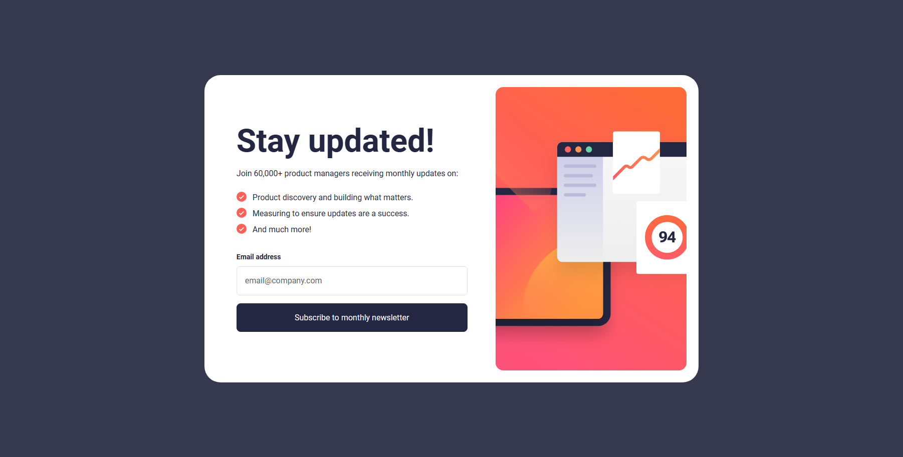
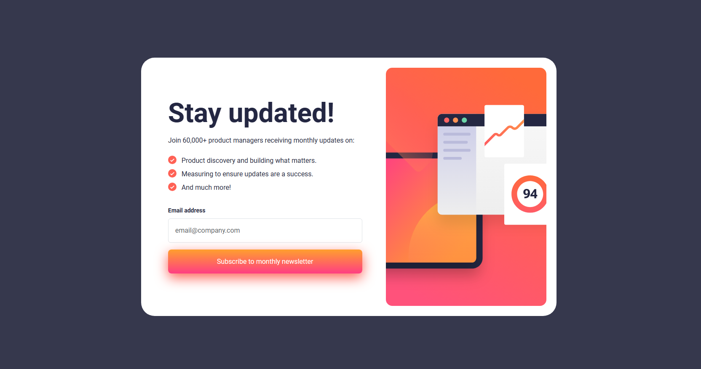
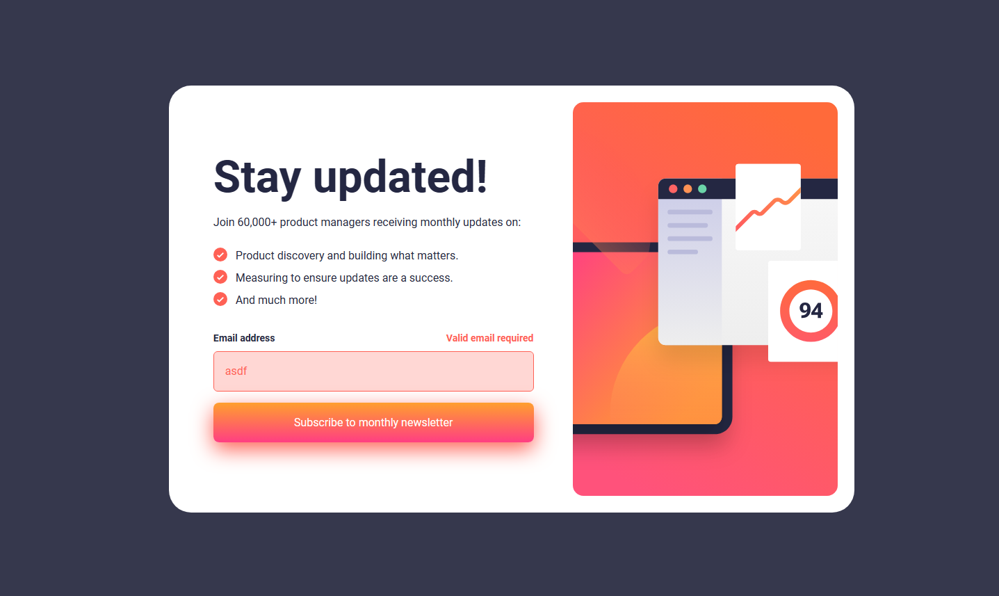
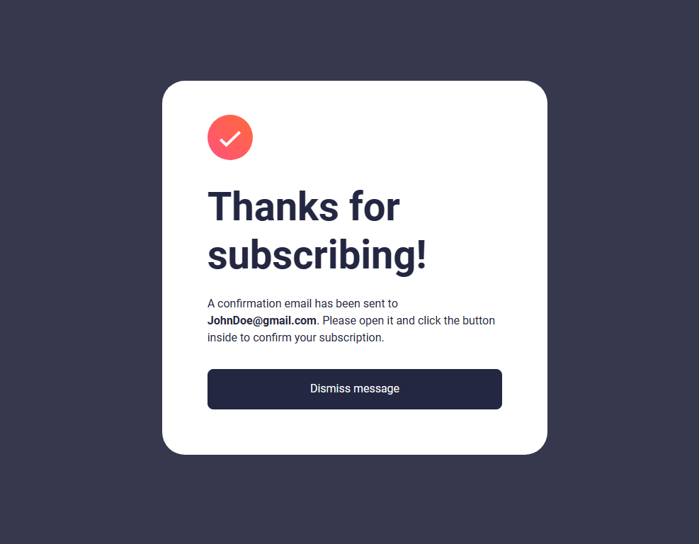

# Frontend Mentor - Newsletter sign-up form with success message solution

This is a solution to the [Newsletter sign-up form with success message challenge on Frontend Mentor](https://www.frontendmentor.io/challenges/newsletter-signup-form-with-success-message-3FC1AZbNrv). Frontend Mentor challenges help you improve your coding skills by building realistic projects. 

## Table of contents

- [Overview](#overview)
  - [The challenge](#the-challenge)
  - [Screenshot](#screenshot)
  - [Links](#links)
- [My process](#my-process)
  - [Built with](#built-with)
  - [What I learned](#what-i-learned)
  - [Continued development](#continued-development)
- [Author](#author)
- [Acknowledgments](#acknowledgments)

## Overview

Newsletter sign-up form with success message. I took this project on so that I could get more used to Bootstrap and Jquery. I also ended up learning how to use webpack so that I could deploy the project on github pages. This project is optimized for mobile and desktop per the specifications of the design file. 

### The challenge

Users should be able to:

- Add their email and submit the form
- See a success message with their email after successfully submitting the form
- See form validation messages if:
  - The field is left empty
  - The email address is not formatted correctly
- View the optimal layout for the interface depending on their device's screen size
- See hover and focus states for all interactive elements on the page

### Screenshot

### Links

- Solution URL:(https://github.com/DEAckeret/Newsletter-Challenge)
- Live Site URL:(https://deackeret.github.io/Newsletter-Challenge/)

## My process

It took me a bit to consider how I wanted to set things up with bootstrap but after reading some of the documentation I figured out a basic layout. Most of the effort on this project was getting used to what jQuery offers with DOM manipulation and how bootstrap classes effect the styling. Once I got comfortable I started to understand how both of these technologies can work in tandem. I had a few things I threw into a css file but I mostly forced myself to rely on bootstrap classes.

### Built with

- Jquery
- Bootstrap
- Webpack

### What I learned

I worked more on solidifying my knowlege of jquery and bootstrap. The project itself didn't take me that long but when I tried to deploy it on github pages I noticed neither my bootstrap or jquery was working. I figured out that I had to bundle my files and opted for using webpack since I had looked into it before. This was my first time actually bundling though so I it took some trial and error but eventually got it working and gained a better understanding of how it works. 

### Continued development

In the future I want to learn more about loaders (maybe for getting used to bundling sass that way? I compiled the sass file so I didnt' need loaders  this time for that.) and the other features of webpack. 

## Author

- Frontend Mentor - [@DEAckeret](https://www.frontendmentor.io/profile/DEAckeret)

## Acknowledgments

Id like to thank Front End Mentor for the opportunity to work on this project! 
